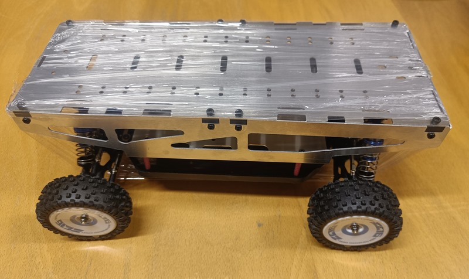
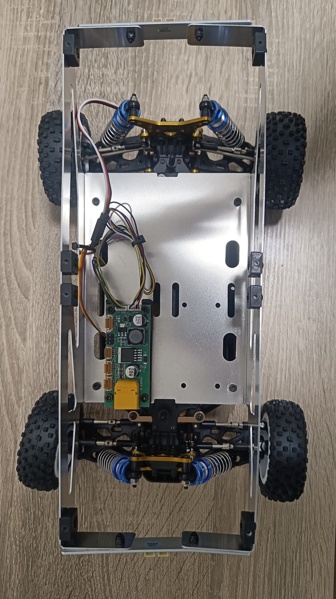
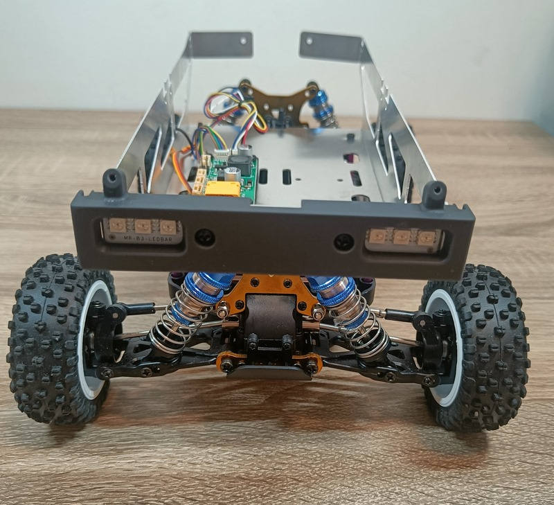
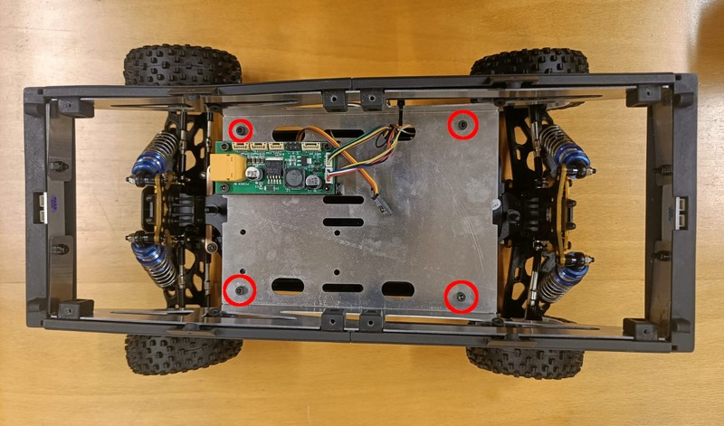
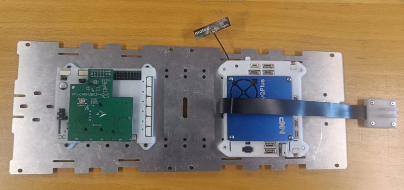
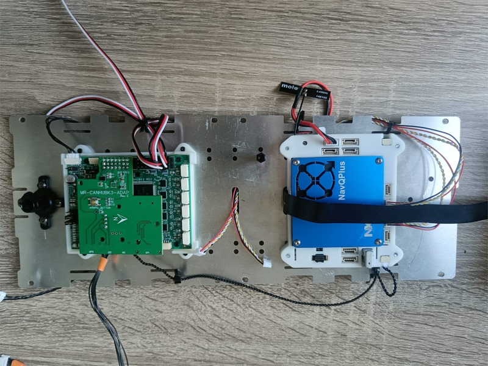
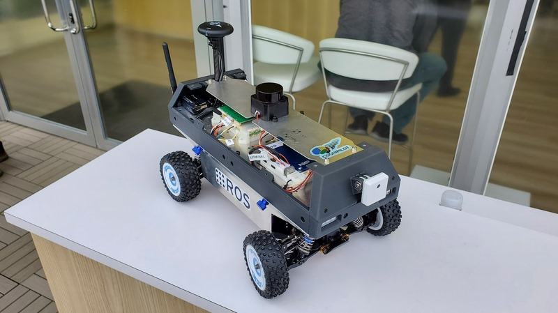

# Hardware : composants et montage

Le buggy est constitué des éléments de l'introduction, reçus dans le kit pour la NXPCup 2024.

## La base motorisée et le PDB

En retirant la plaque métalique du dessus on a accès à l'intérieur du rover 

Ici est représenté le composant de distribution de la puissance : c'est lui qui va alimenté correctement les composants du rover ainsi que le moteur. La batterie d'alimentation va justement être également placée à cet étage, collée avec des scratchs juste à côté de la carte d'alimentation en puissance.

## Armature en plastique

Autour de cette partie on monte également l'armature en plastique (imprimé en 3D par NXP) avec des LEDS 

 

## Les cartes intelligentes

On monte également alors deux nouvelles cartes : le NavQ+ et le MRCANHUB. La première s'occupe de la comunication entre un ordinateur, et les éléments externes (GPS, Lidar) avec le MRCANHUB qui s'occupe lui de commander le robot (moteurs). 

 

## Les capteurs

Finalement en rajoutant la caméra avant, le GPS et le Lidar notre rover ressemble à : 

## Batterie

Une fois le robot monté, on peut accéder aux câbles de la batterie via un des côtés du rover.