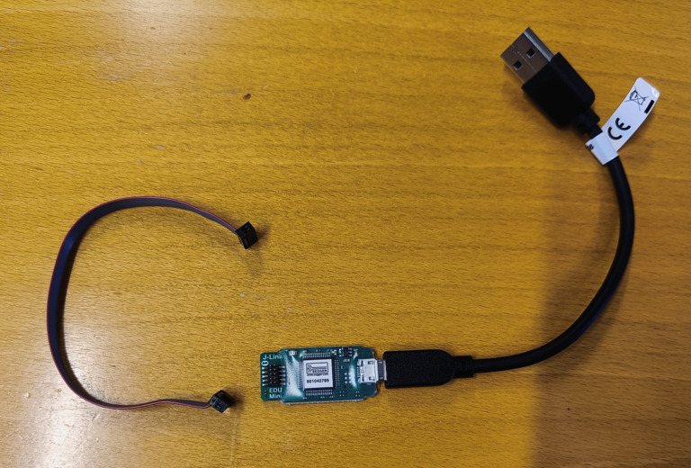
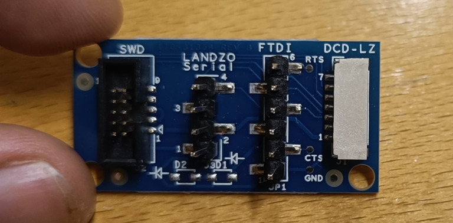
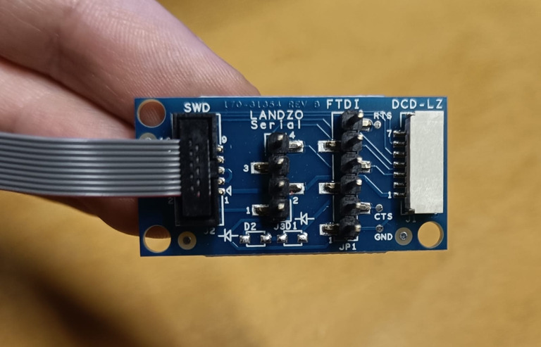
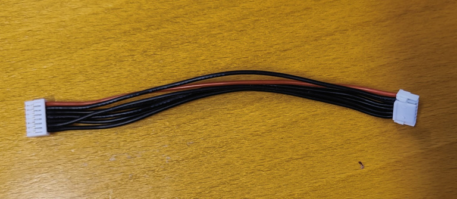
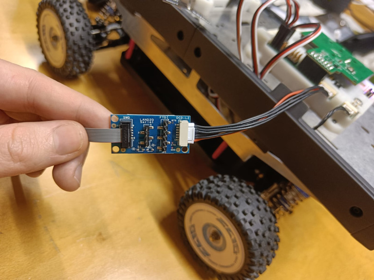
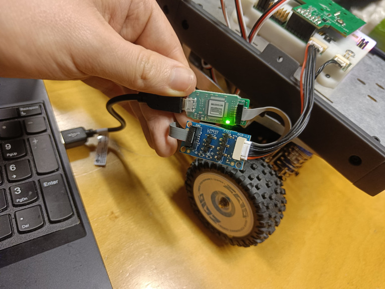

# Connexion avec le MrCANHUB

Cette courte partie s'intéresse à la connexion filaire entre la carte **MrCANHUB** et votre ordinateur **host**, à l'aide d'une carte **JLink**.

D'abord il faut installer ce soft sur votre ordinateur, sur le site [SEGGER](https://www.segger.com/downloads/jlink/), il s'agit du premier soft qui est à télécharger.

Ensuite il faut connecter le **MrCANHUB** à votre ordinateur **host**. Pour ce faire il faut impérativement redémarrer votre ordinateur, et ne pas lancer l'image docker dans un premier temps.

Le branchement est le suivant :

Attention au sens du câble, ce n'est pas symétrique, vous devez être précisément dans la configuration des images précédentes

Le câble de votre ordinateur doit être sur de l'USB-A2 de préférence : il existe des soucis lorsque le port est en USB-A3. Une fois tout correctement branché et le logiciel installé vous pouvez brancher la batterie du Rover. **Attention il faut veiller à ce que il n'y ai aucun câble USB-A <-> USB-C de brancher entre le buggy et votre ordinateur host (par exemple si vous avez oublié de l'enlever à l'étape de la NavQ).**

