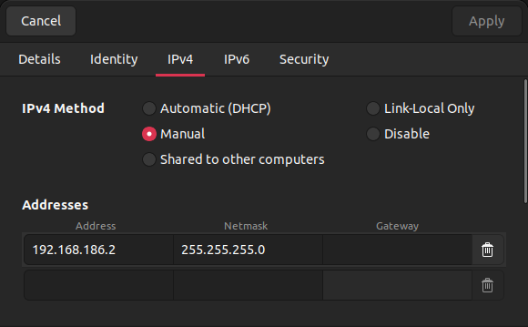

# Connexion avec la NavQ+

Cette partie du répertoire s'intéresse à la manière de se connecter et les différents modes de connexion de la **NavQ+** tout au long du développement

## Connexion à la NavQ+ en mode FLASH

Dans ce mode de connexion la **NavQ+** **ne doit pas être alimentée par la batterie du buggy**. Il faut utiliser un câble **USB-A <-> USB-C** et le connecter au port **USB1** de la carte, comme le montre l'image suivante.

Il faut également mettre la carte en mode FLASH en bougeant les switchs en mode **ON-OFF** comme le montre l'image suivante


## Connecter la NavQ+ au WIFI

Dans cette section, la **NavQ+** ne doit pas être alimentée par la batterie du buggy. Il faut utiliser un câble **USB-A <-> USB-C** et le connecter au port **USB2** de la carte, son emplacement est indiqué sur l'image suivante.

Il faut également mettre la carte en mode eMMC, en bougeant les switchs en mode **OFF-ON**, il s'agit de **l'inverse de ce qui est représenté sur l'image suivante**


Une fois les câbles connectés il faut modifier votre **network manager** Ubuntu, pour celà ouvrez les paramètres système et en dessous de "Wifi" allez dans "Réseau", ajouter un nouveau réseau filaire (ce mode n'est disponible que si vous avez un port éthernet par défaut ou si vous avez installé les pilotes éthernet manuellement), en mode manuel et rentrez ces valeurs :



Parfois la connexion se fait mal, dans ce cas désactivez le Wifi de votre ordinateur, cela forcera votre Ubuntu à se connecter à la NavQ.

Vous pouvez alors pénétrez la **NavQ** en ssh

````
ssh user@192.168.186.3
````

Sélectionner "yes" pour vous connecter puis comme mot de passe: **user**

Une fois en SSH dans la NavQ vous devez la connecter à un Wifi à proximité (un partage de connexion peut fonctionner).

````
sudo nmcli device wifi connect <network_name> password "<password>"
````

Ensuite vous devez **récupérer l'adresse de la carte WIFI du NavQ+**, pour cela vous devez rentrer la commande 

````
ip address
````

Vous devez ensuite chercher la ligne contenant `mlan0` et chercher l'adresse IP sous la forme `10.0.0.0`.

